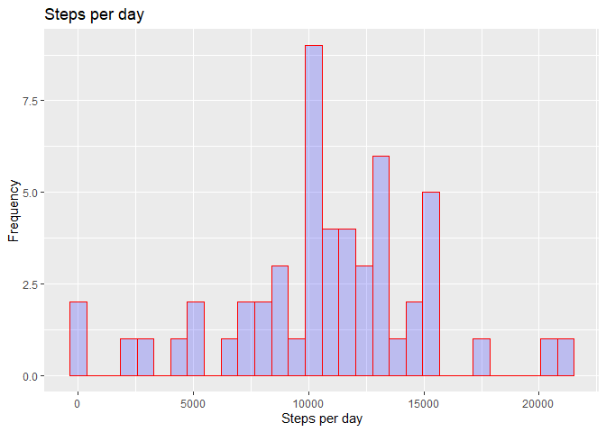
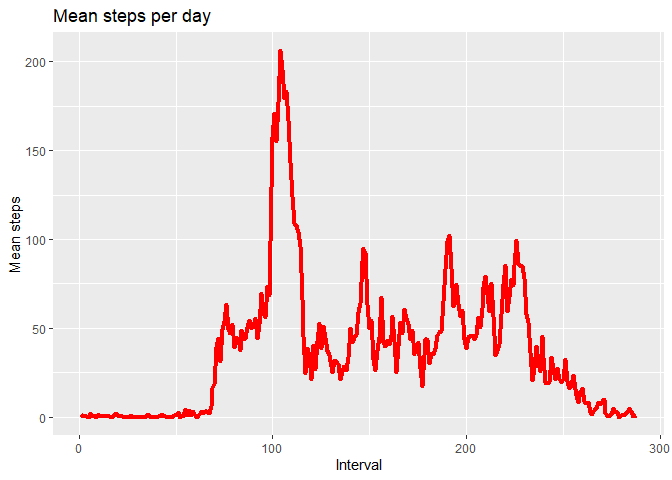
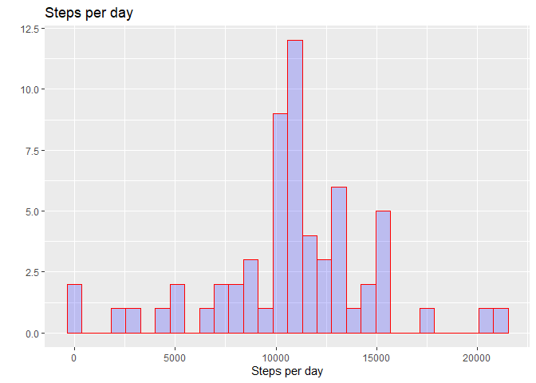
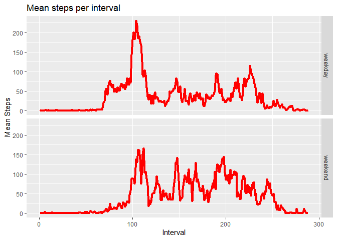

## Loading and preprocessing the data

The following code download the data from the provided address and store the table in memory


```r
if (!file.exists("activity.csv")) { 
    fileURL <- "https://d396qusza40orc.cloudfront.net/repdata%2Fdata%2Factivity.zip"
    filename <- "temp.zip"
    download.file(fileURL, filename)
    unzip(filename)
    file.remove(filename)
}

activity <- read.csv("activity.csv")
activity$date <- as.Date(as.character(activity$date))
```

## What is mean total number of steps taken per day?

The first step is calculating the total and average (average per interval) number of step performed each day


```r
total_steps <- tapply(activity$steps, activity$date, sum)
mean_steps <- tapply(activity$steps, activity$date, mean)
steps_df <- data.frame(date=unique(activity$date),
                             total=total_steps,
                             mean=mean_steps)
```

The histogram below represents the total number of step per day


```r
qplot(steps_df$total,
      main = "Steps per day", 
      xlab = "Steps per day",
      ylab = "Frequency",
      fill=I("blue"), 
      col=I("red"), 
      alpha=I(.2))
```

```
## `stat_bin()` using `bins = 30`. Pick better value with `binwidth`.
```

```
## Warning: Removed 8 rows containing non-finite values (stat_bin).
```

<!-- -->

Let's calculate the mean and median values.


```r
mean_steps <- mean(steps_df$total, na.rm = TRUE)
median_steps <- median(steps_df$total, na.rm = TRUE)
```

The average number of steps per day is: **1.0766189\times 10^{4}**.

The median number of steps per day is: **10765**.

## What is the average daily activity pattern?

Average number of steps performed in each interval (timeserie)


```r
mean_steps_by_interval <- tapply(activity$steps, activity$interval, mean, na.rm=TRUE)
mean_steps_by_interval_df <- data.frame(interval=1:length(mean_steps_by_interval),
                                        mean=mean_steps_by_interval)

ggplot(data=mean_steps_by_interval_df, aes(x=interval, y=mean)) +
geom_line(stat="identity", 
         col=I("red"),
         lwd=1.5) +
labs(title = "Mean steps per day") +
xlab("Interval") +
ylab("Mean steps")
```

<!-- -->

During which interval were performed the maximum number of steps (on average)?


```r
interval_max_average_steps <- which.max(mean_steps_by_interval)
```

The interval with the max number of average steps is the number **104**.

## Imputing missing values


```r
na_number <- sum(is.na(activity$steps))
na_frequency <- mean(is.na(activity$steps))
```

The number of missing data (NAs) is **2304**.
The frequency of missing data (NAs) is **0.1311475**.

Missing data were handled replacing NAs with the average values of steps for that each interval (calculated across the days with an non-NA number of steps recorded). This was performed applaying the function `imputing_missing_data` on each row of the `activity` dataset and storing the resulting new dataset as `activity2`. See code below.


```r
imputing_missing_data <- function(row) {
    if (is.na(row['steps'])) {
        row['steps'] <- as.numeric(mean_steps_by_interval[trimws(as.character(row['interval']))])
    }
    row
}
activity2 <- apply(activity, 1, FUN=imputing_missing_data)
activity2 <- data.frame(t(activity2))
activity2$steps <- as.numeric(as.character(activity2$steps)) 
```

After imputing the missing data this is the resulting histogram of the total number of steps per day.


```r
total_steps2 <- tapply(activity2$steps, activity$date, sum)
mean_steps2 <- tapply(activity2$steps, activity$date, mean)
steps_df2 <- data.frame(date=unique(activity2$date),
                       total=total_steps2,
                       mean=mean_steps2)
qplot(steps_df2$total,
      main = "Steps per day", 
      xlab = "Steps per day",  
      fill=I("blue"), 
      col=I("red"), 
      alpha=I(.2))
```

```
## `stat_bin()` using `bins = 30`. Pick better value with `binwidth`.
```

<!-- -->


```r
mean_steps2 <- mean(steps_df2$total)
median_steps2 <- median(steps_df2$total)
```

The values of mean and median numbers of steps per day are respectively **1.0766189\times 10^{4}** and **1.0766189\times 10^{4}**.

## Are there differences in activity patterns between weekdays and weekends?

Last but not least let's classify each data in the `activity2` dataframe based on the day of the week (either weekday or weekend) and calculate the mean steps values for each interval.


```r
activity2$day <- apply(activity2, 1, FUN = function(elm) {weekdays(strptime(elm['date'],"%Y-%m-%d"))})
weekend_vector <- c("Saturday","Sunday")
activity2$day2 <- apply(activity2, 1, FUN = function(elm) {
    if (elm['day'] %in% weekend_vector) {"weekend"}
    else {"weekday"}
})
mean_steps_by_interval_2 <- tapply(activity2$steps, list(activity2$interval,activity2$day2), mean)

mean_steps_by_interval_3 <- data.frame(interval=rep(1:length(mean_steps_by_interval),2),
                                       mean=c(mean_steps_by_interval_2[,"weekday"],
                                              mean_steps_by_interval_2[,"weekend"]),
                                       day=c(rep("weekday",length(mean_steps_by_interval)),
                                             rep("weekend",length(mean_steps_by_interval))))
```

The mean values are stored in the dataframe `mean_steps_by_interval_3`. Panel plot available below.


```r
ggplot(data=mean_steps_by_interval_3, aes(x=interval, y=mean)) + 
    geom_line(stat="identity",
         col=I("red"),
         lwd=1.5) +
    facet_grid(rows = vars(day)) +
    labs(title = "Mean steps per interval") +
    xlab("Interval") +
    ylab("Mean Steps")
```

<!-- -->
